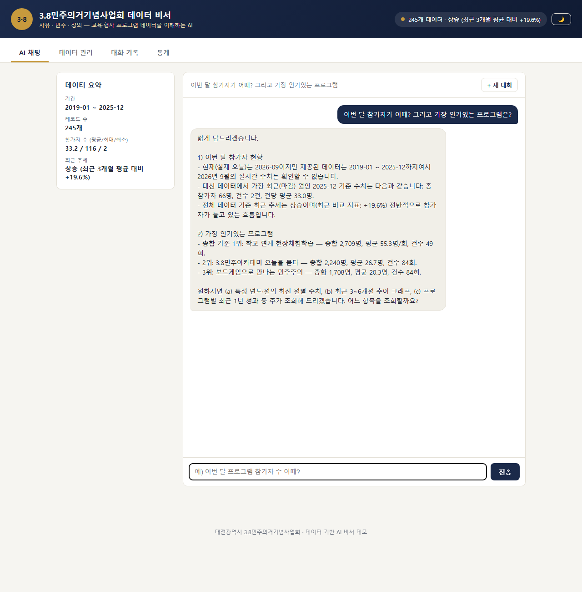
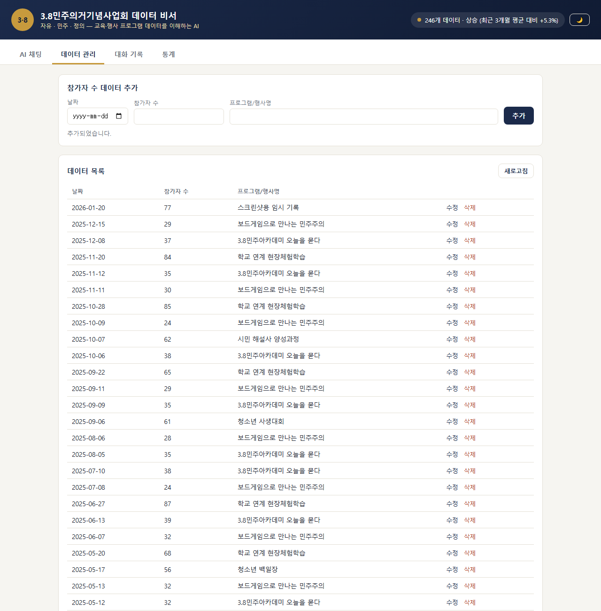
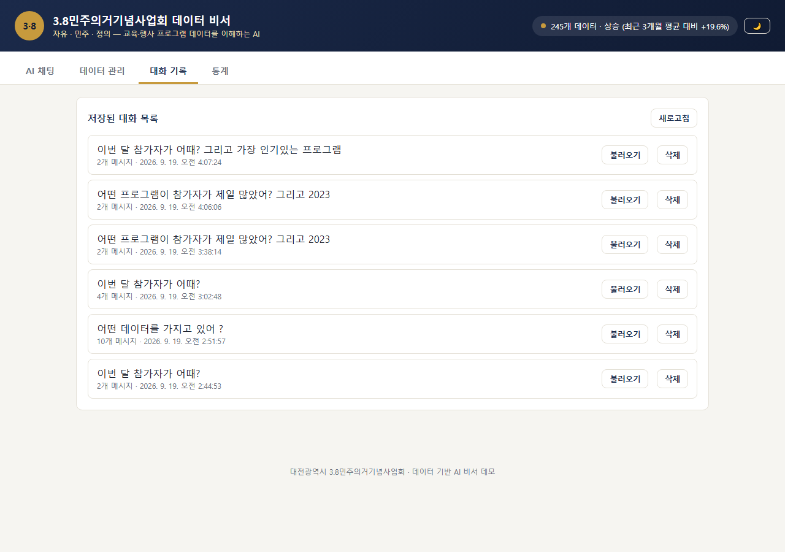
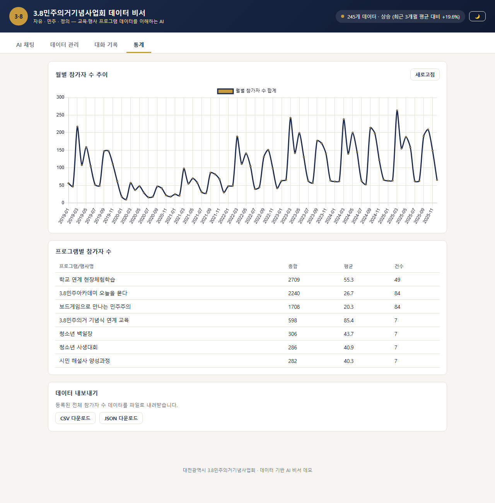
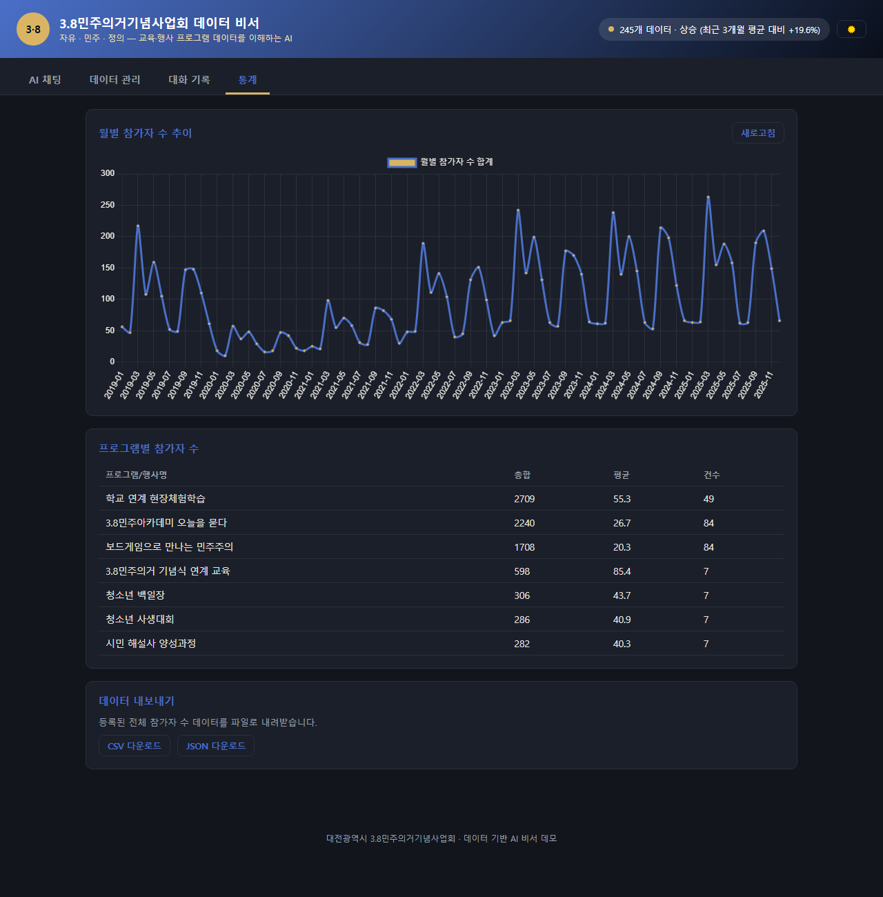

# 실행 결과 (로컬 실행 + 실제 배포 완료 기록)

> 이 문서는 `과제계획서.md`의 "2. 최종 결과물" 4가지 기능과 "8. 결과 예시"에 대응하는 **실제 실행 결과**입니다.
> 아래 요청/응답은 모두 서비스를 직접 기동/배포한 뒤 curl로 호출해서 얻은 실제 값이며, 예시로 지어낸 값이 아닙니다.

## 0. 실행 환경

### 배포 URL (실제 운영 중)

| 항목 | URL |
|---|---|
| 프론트엔드 (Vercel) | https://frontend-blond-one-98.vercel.app |
| 백엔드 API (Render) | https://three8demo-backend.onrender.com |
| Swagger 문서 | https://three8demo-backend.onrender.com/docs |

> Render 무료 티어는 일정 시간 요청이 없으면 슬립되어 첫 요청이 30초~1분 정도 걸릴 수 있습니다.

### 최초 검증은 로컬에서 진행

| 항목 | 내용 |
|---|---|
| 실행 일시 | 2026-09-19 |
| 백엔드 (로컬) | http://localhost:8000 (`uvicorn app.main:app --reload`) |
| 프론트엔드 (로컬) | http://localhost:3000 (`python -m http.server 3000`) |
| DB | Firebase Firestore (`data`, `conversations` 컬렉션) — 로컬/배포 환경이 동일한 프로젝트 공유 |
| AI 모델 | `gpt-5-mini` (OpenAI 호환 프록시: `copa.codyssey.kr`) |
| 시드 데이터 | `backend/seed_data.py` 실행, 245건 업로드 |

---

## 1. 데이터 기반 AI 채팅

**입력/요청**

```
POST /api/chat
Content-Type: application/json

{"message": "이번 달 참가자가 어때?"}
```

**출력/화면 (실제 응답)**

```json
{
  "conversation_id": "UUgwf2aIDYjg1RBrWjRv",
  "reply": "질문 감사합니다. 다만 확인이 필요합니다.\n\n요약된 데이터 기준으로 알려드리면:\n- 데이터 기간: 2019-01 ~ 2025-12 (따라서 2026년 현재의 '이번 달' 수치는 데이터에 없습니다)\n- 총 레코드: 245\n- 참가자 합계: 8,129명\n- 평균: 33.2명\n- 최대: 116명\n- 최소: 2명\n- 최근 추세: 상승 (최근 3개월 평균 대비 +19.6%)\n\n즉, '이번 달(실제 현재 달, 2026-09 등)'의 참가자 수는 데이터 범위를 벗어나므로 알 수 없습니다. ..."
}
```

같은 `conversation_id`로 이어서 질문한 결과:

```
POST /api/chat
{"message": "그럼 지금까지 중에 참가자가 가장 많았던 기록은 몇 명이야?", "conversation_id": "UUgwf2aIDYjg1RBrWjRv"}
```

```json
{
  "conversation_id": "UUgwf2aIDYjg1RBrWjRv",
  "reply": "최대 참가자 수는 116명입니다.\n\n참고: 데이터는 2019-01~2025-12 기간의 총 245개 레코드 기준이고, 전체 평균은 33.2명입니다. 어떤 행사(날짜/프로그램)에서 나온 기록인지는 요약 데이터에 없으니 확인을 원하시면 해당 레코드 조회를 진행해 드리겠습니다."
}
```

데이터 요약(총합/평균/최대/최소/추세)이 실제로 답변에 반영됨을 확인했습니다.

---

## 2. 데이터 관리 (CRUD)

**입력/요청**

```
POST /api/data
{"date": "2026-01-15", "value": 42, "memo": "3.8민주아카데미 오늘을 묻다"}
```

**출력/화면 (실제 응답, 201 Created)**

```json
{
  "date": "2026-01-15",
  "value": 42.0,
  "memo": "3.8민주아카데미 오늘을 묻다",
  "id": "7wNCtK2857tYjA0sASQf"
}
```

`GET /api/data`로 목록을 다시 조회하면 방금 추가한 레코드가 포함되어 246건이 반환되는 것을 확인했습니다.

배포된 프로덕션(`https://three8demo-backend.onrender.com`)에서 수정(`PUT`)·삭제(`DELETE`)도 실제로 호출해 확인했습니다.

```
PUT /api/data/7wNCtK2857tYjA0sASQf
{"date": "2026-01-15", "value": 50, "memo": "3.8민주아카데미 오늘을 묻다 (수정 테스트)"}
→ 200 OK, {"date":"2026-01-15","value":50.0,"memo":"3.8민주아카데미 오늘을 묻다 (수정 테스트)","id":"7wNCtK2857tYjA0sASQf"}

DELETE /api/data/7wNCtK2857tYjA0sASQf
→ 204 No Content
```

삭제 후 `GET /api/data/summary`로 확인한 결과 `count`가 다시 245로 돌아와 정상적으로 반영됨을 확인했습니다(테스트용으로 추가했던 레코드였으므로 삭제로 정리).

---

## 3. 대화 기록 저장 및 불러오기

**입력/요청 — 목록 조회**

```
GET /api/conversations
```

**출력 (실제 응답)**

```json
[
  {"id":"UUgwf2aIDYjg1RBrWjRv","title":"이번 달 참가자가 어때?","message_count":4,"created_at":"2026-09-19T03:02:10.475898","updated_at":"2026-09-19T03:02:48.620746"},
  {"id":"sn1mj3BosjPyr0ewHVia","title":"어떤 데이터를 가지고 있어 ?","message_count":10,"created_at":"2026-09-19T02:47:54.704564","updated_at":"2026-09-19T02:51:57.066062"},
  {"id":"30BqIBMQVQ48ktz3o8AT","title":"이번 달 참가자가 어때?","message_count":2,"created_at":"2026-09-19T02:44:38.586693","updated_at":"2026-09-19T02:44:53.509845"},
  {"id":"td5pWTp85WZcPFpRR5qZ","title":"이번 달 참가자가 어때?","message_count":2,"created_at":"2026-09-19T02:42:24.880432","updated_at":"2026-09-19T02:42:32.237193"}
]
```

**입력/요청 — 특정 대화 불러오기**

```
GET /api/conversations/UUgwf2aIDYjg1RBrWjRv
```

**출력 (실제 응답, messages 전체 포함)**

```json
{
  "id": "UUgwf2aIDYjg1RBrWjRv",
  "title": "이번 달 참가자가 어때?",
  "messages": [
    {"role": "user", "content": "이번 달 참가자가 어때?", "created_at": "2026-09-19T03:02:10.475898"},
    {"role": "assistant", "content": "질문 감사합니다. ...(1번 항목 답변과 동일)", "created_at": "2026-09-19T03:02:24.228743"},
    {"role": "user", "content": "그럼 지금까지 중에 참가자가 가장 많았던 기록은 몇 명이야?", "created_at": "2026-09-19T03:02:42.120750"},
    {"role": "assistant", "content": "최대 참가자 수는 116명입니다. ...", "created_at": "2026-09-19T03:02:48.620746"}
  ],
  "created_at": "2026-09-19T03:02:10.475898",
  "updated_at": "2026-09-19T03:02:48.620746"
}
```

`/api/chat` 호출 시마다 대화가 자동 저장되고, `GET /api/conversations/{id}`로 전체 메시지를 다시 불러올 수 있음을 확인했습니다.

삭제(`DELETE /api/conversations/{id}`)도 프로덕션에서 실제로 확인했습니다: 테스트로 만든 대화 하나(`td5pWTp85WZcPFpRR5qZ`)를 삭제 요청해 204 응답을 받았고, 이후 목록 조회 결과 3건으로 줄어든 것을 확인했습니다.

---

## 4. 배포 및 문서화

- 로컬 실행 확인: 완료
- README.md 실행 방법/환경 변수/배포 URL 안내: 완료
- **Render(백엔드) 배포 완료**: https://three8demo-backend.onrender.com (Blueprint 배포, `backend/render.yaml` 기반)
- **Vercel(프론트엔드) 배포 완료**: https://frontend-blond-one-98.vercel.app (빌드 시 `API_BASE_URL`을 Render URL로 주입)
- **배포 간 CORS 연결 실제 확인**: `Origin: https://frontend-blond-one-98.vercel.app` 헤더로 preflight(OPTIONS) 및 실제 GET 요청을 보내 `access-control-allow-origin`이 정상 반환되는 것을 확인했습니다.

### 배포 과정에서 발견/수정한 이슈

1. **`FIREBASE_SERVICE_ACCOUNT_JSON` 값에 키 이름이 같이 들어감**: Render 환경변수 입력 시 `FIREBASE_SERVICE_ACCOUNT_JSON={...}` 줄 전체를 값 칸에 붙여넣어, 값 앞에 `FIREBASE_SERVICE_ACCOUNT_JSON=`가 포함되어 JSON 파싱 실패(500 에러) 발생 → Render API로 값에서 접두어를 제거하고 재배포하여 해결.
2. **`ALLOWED_ORIGINS`가 로컬 주소만 포함**: 처음엔 `http://localhost:3000`만 설정되어 있어 Vercel에서 오는 요청이 CORS로 막힘 → Vercel 배포 URL들을 추가하고 재배포하여 해결.
3. **`gpt-5-mini`가 reasoning 모델이라 `max_tokens`를 다 쓰고도 빈 답변**: `CHAT_MAX_TOKENS=500`에서는 `finish_reason: length`로 답변이 비어 있었음 → `1500`으로 올려 해결 (로컬 검증 후 `render.yaml`에도 반영).
4. **`mcp[cli]` 추가 후 Render 빌드 의존성 충돌**: `mcp==2.2.0`이 `pydantic>=2.12.0`, `uvicorn>=0.31.1`을 요구해 기존에 고정해둔 구버전들과 충돌 → 로컬에서 이미 함께 설치·검증된 최신 조합(`fastapi 0.141.1`, `uvicorn 0.53.0`, `firebase-admin 7.6.0`, `openai 3.16.2`, `pydantic 2.13.5`)으로 `requirements.txt`를 일괄 갱신해 해결.

### 실제 배포 화면 캡처 (https://frontend-blond-one-98.vercel.app)

**데이터 요약이 보이는 채팅 화면**



**데이터 관리 화면 (추가 동작)**



**대화 기록 화면 (불러오기 버튼)**



---

## 5. 보너스 — AI 도구 호출(Function Calling) + MCP Server

시스템 프롬프트에는 전체 집계(요약)만 들어가므로, 요약만으로는 답할 수 없는 질문을 GPT가 스스로
`get_monthly_breakdown` / `get_program_breakdown` / `get_data_summary` 도구를 호출해 Firestore의
실제 데이터를 조회한 뒤 답하도록 구현했습니다. (`backend/app/services/tools.py`, `openai_service.get_chat_reply`)

**실제 요청/응답 (배포 환경, `https://three8demo-backend.onrender.com`)**

```
POST /api/chat
{"message": "어떤 프로그램이 참가자가 제일 많았어? 그리고 2023년 월별로는 어땠어?"}
```

GPT가 `get_program_breakdown()`과 `get_monthly_breakdown(year=2023)`을 스스로 호출한 뒤 반환한 답변:

```json
{
  "conversation_id": "glbwjXGLsuYVTxntrrtg",
  "reply": "좋습니다. 조회 결과 기준으로 답변드립니다.\n\n1) 참가자가 가장 많은 프로그램\n- 프로그램명: 학교 연계 현장체험학습\n- 총합 참가자: 2,709명\n- 평균 참가자: 55.3명 (건당)\n- 건수(회수): 49회\n\n2) 2023년 월별 현황 (총합 / 평균 / 건수)\n- 2023-01: 63 / 31.5 / 2\n- 2023-02: 66 / 33.0 / 2\n- 2023-03: 242 / 60.5 / 4\n- 2023-04: 142 / 47.3 / 3\n- 2023-05: 199 / 49.8 / 4\n- 2023-06: 131 / 43.7 / 3\n- 2023-07: 63 / 31.5 / 2\n- 2023-08: 57 / 28.5 / 2\n- 2023-09: 177 / 44.2 / 4\n- 2023-10: 170 / 42.5 / 4\n- 2023-11: 140 / 46.7 / 3\n- 2023-12: 64 / 32.0 / 2\n\n요약 코멘트\n- 2023년 연간 총 참가자 수(월별 합계): 1,514명.\n- 최고월: 3월(242명), 다음으로 5월(199명), 9월(177명), 10월(170명).\n- 최저월: 8월(57명), 1·7월·12월도 낮음(각 63, 63, 64명).\n- 계절적 패턴: 봄(3~5월)과 가을(9~10월)에 참가자가 집중되는 경향이 있습니다.\n\n더 필요한 분석(프로그램별 월별 비교, 특정 프로그램의 2023년 월별 추이 등)이 필요하면 말씀해 주세요."
}
```

같은 시점 `GET /api/data/statistics`가 반환한 원본 수치와 대조해, 위 답변의 모든 숫자(2,709 / 55.3 / 49,
2023년 각 월별 총합/평균/건수)가 정확히 일치함을 확인했습니다 — GPT가 실제로 도구를 호출해 받은 데이터를
그대로 인용해 답했다는 뜻입니다.

**MCP 서버 검증** (`backend/mcp_server.py`) — 동일한 3개 도구를 MCP stdio 서버로도 노출하고,
실제 `ClientSession`으로 접속해 확인했습니다.

```
initialize → list_tools() → 3개 도구(get_data_summary, get_monthly_breakdown, get_program_breakdown) 확인
call_tool("get_program_breakdown", {}) → REST API(/api/data/statistics)와 동일한 값 반환
call_tool("get_monthly_breakdown", {"year": 2023}) → REST API와 동일한 2023년 월별 데이터 반환
```

---

## 6. 보너스 — 인사이트·UX 고도화

`GET /api/data/statistics`로 요약을 월별/프로그램별 세부 지표까지 확장하고, 프론트엔드에 "통계" 탭을
새로 만들어 Chart.js 그래프·CSV/JSON 내보내기·다크 모드 토글을 구현했습니다. 실제 배포 사이트를
헤드리스 브라우저(Playwright)로 직접 조작해 콘솔 에러 없이 동작함을 확인했습니다: 통계 탭 클릭 → 차트/표
렌더링 → 다크 모드 토글(차트 색상도 함께 재조정) → CSV 다운로드 → JSON 다운로드, 전체 과정에서 에러 0건.

**통계 탭 (라이트/다크 모드)**

| 라이트 모드 | 다크 모드 |
|---|---|
|  |  |

---

## 8. 결과 예시 — 실제 데이터 요약 API 응답

```
GET /api/data/summary
```

```json
{
  "period": "2019-01 ~ 2025-12",
  "count": 245,
  "metrics": {
    "total": 8129.0,
    "average": 33.2,
    "max": 116.0,
    "min": 2.0
  },
  "trend": "상승 (최근 3개월 평균 대비 +19.6%)"
}
```

### 실제 시스템 프롬프트 (`backend/app/services/openai_service.py`)

```
당신은 대전광역시 3.8민주의거기념사업회의 데이터 분석 비서입니다.
3.8민주의거의 정신(자유·민주·정의)을 계승하는 기념관의 교육·행사 프로그램 운영을 돕습니다.

[교육·행사 참가자 수 데이터 요약]
- 데이터 기간: 2019-01 ~ 2025-12
- 총 레코드: 245개
- 참가자 수 지표(총합/평균/최대/최소): 8129.0 / 33.2 / 116.0 / 2.0
- 최근 추세: 상승 (최근 3개월 평균 대비 +19.6%)

위 데이터를 근거로 담당자의 질문에 구체적인 수치를 인용하며 답변하세요.
데이터에 없는 내용은 추측하지 말고 모른다고 답하세요.
```

### AI 대화 예시 (실제 대화 원문)

```
사용자: "이번 달 참가자가 어때?"
AI: "요약된 데이터 기준으로 알려드리면 - 데이터 기간: 2019-01 ~ 2025-12
     (2026년 현재의 '이번 달' 수치는 데이터에 없습니다)
     참가자 합계: 8,129명 / 평균: 33.2명 / 최대: 116명 / 최소: 2명
     최근 추세: 상승 (최근 3개월 평균 대비 +19.6%)"

사용자: "그럼 지금까지 중에 참가자가 가장 많았던 기록은 몇 명이야?"
AI: "최대 참가자 수는 116명입니다.
     데이터는 2019-01~2025-12 기간 총 245개 레코드 기준, 전체 평균은 33.2명입니다."
```

> 과제계획서의 예시(매출 데이터, 620만원/850만원)와 달리 이 프로젝트는 **참가자 수(명)** 시계열 데이터를 사용하므로,
> AI가 "모른다"고 답하는 부분(특정 월/특정 행사 단위 수치)이 있습니다. 이는 `build_summary()`가
> 전체 집계값만 프롬프트에 주입하고 월별·프로그램별 세부 데이터는 주입하지 않기 때문이며, 의도된 동작입니다.
